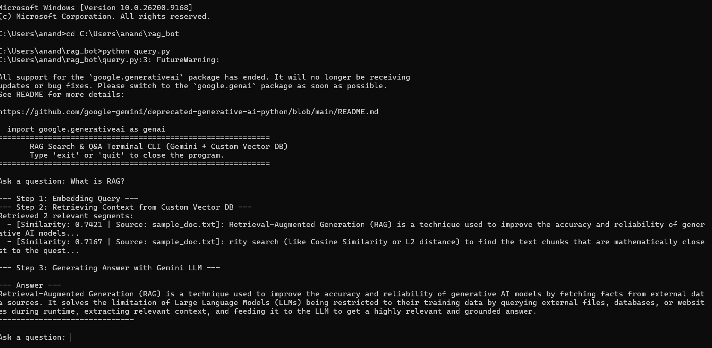
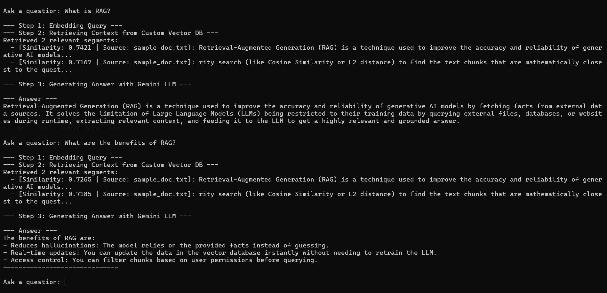

# Document Q&A Bot (RAG from Scratch)

This is a basic starter project designed to help you learn:
1. **Document chunking**
2. **Text Embeddings** (using Google Gemini API `models/gemini-embedding-001`)
3. **Vector Database search** (using a custom, file-backed Vector Database built from scratch)
4. **Retrieval-Augmented Generation (RAG)** (using Gemini LLM `gemini-2.5-flash`)

---

## 🚀 Setup Instructions

### 1. Open Terminal and Navigate to Project
Make sure your terminal is inside the project directory:
```bash
cd C:/Users/anand/rag_bot
```

### 2. Install Dependencies
Install the required Python packages:
```bash
pip install -r requirements.txt
```

### 3. Add your API Key
1. Open the `.env` file in this directory.
2. Replace `YOUR_GEMINI_API_KEY_HERE` with your actual Gemini API key from [Google AI Studio](https://aistudio.google.com/).

---

## 🏃 Running the Project

### Step 1: Ingest the Document
Run the ingestion script to split the text in `sample_doc.txt`, convert it into embeddings, and store it in ChromaDB:
```bash
python ingest.py
```
*(Optionally, you can pass another text/pdf file: `python ingest.py path/to/your/document.pdf`)*

### Step 2: Query and Chat
Run the query script to launch the Q&A terminal CLI:
```bash
python query.py
```
Ask questions like:
- *"What is RAG?"*
- *"What are the benefits of RAG?"*
- *"What is the context window of Gemini 2.5 Flash?"* (this is present in the sample text but is a great test of retrieval)
- *"What is the weather today?"* (should trigger the "not enough information" response because it's not in the context)

---

## 📸 Demo Screenshots
Here is what the command line interface looks like:

### Ingestion Output:


### Query Output:

