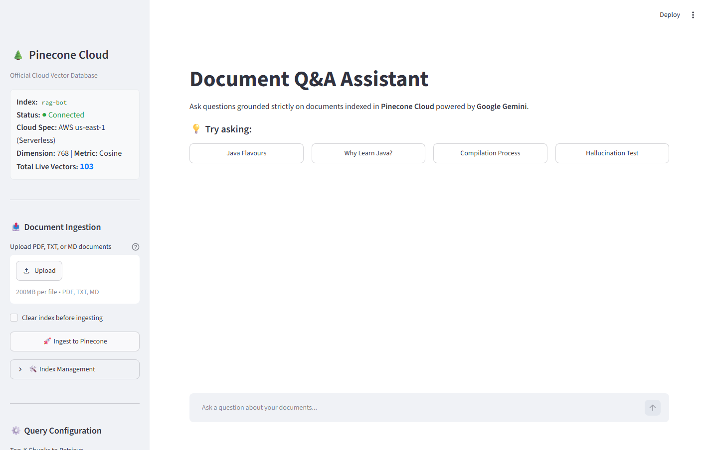
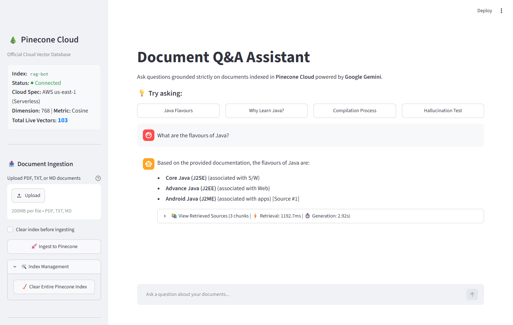

<div align="center">

# 🌲 Document Q&A Bot
### Production RAG with Pinecone Cloud & Google Gemini

[](https://rag-bot-anand9051.streamlit.app)
[](https://www.pinecone.io)
[](https://ai.google.dev)
[](https://python.org)
[](LICENSE)

**[🚀 Launch Live Web App](https://rag-bot-anand9051.streamlit.app)** • **[📸 Demo Screenshots](#-demo-screenshots)** • **[🏗️ Architecture](#️-architecture-overview)** • **[⚡ Features](#-production-features)** • **[🚀 Setup](#-setup-instructions)**

</div>

---

> 🚀 **Live Interactive Demo:** [rag-bot-anand9051.streamlit.app](https://rag-bot-anand9051.streamlit.app)  
> *Upload your documents, inspect real-time vector indexes in Pinecone, and test questions with grounded Gemini Flash generation.*

---

## 📸 Demo Screenshots

### 🌐 Streamlit Interactive Web Application

#### 1. Live Pinecone Index Dashboard & Document Ingestion
Displays connected Pinecone index status (`rag-bot`), AWS serverless cloud spec, real-time live vector count (`103`), and drag-and-drop document upload:


#### 2. Grounded Q&A with Inline Source Citations & Latency Metrics
Generates strictly verified responses using `gemini-2.5-flash`, complete with inline source citation tags (`[Source #1]`), expandable chunk excerpts, cosine similarity scores, and execution benchmarks:


---

### 💻 Terminal CLI Interface

#### Multi-Document Ingestion & Sub-Millisecond Pinecone Search:


#### Strict Anti-Hallucination Guardrails & Performance Metrics:


---

## 🏗️ Architecture Overview

```
                         [ User Documents (.txt / .pdf) ]
                                        │
                                        ▼
                  [ Recursive Boundary-Aware Chunking ]
                        (Paragraphs / Sentences / Words)
                                        │
                                        ▼
                   [ Dense Vector Embeddings (Gemini) ]
                        (task_type: RETRIEVAL_DOCUMENT)
                                        │
                                        ▼
               [ Pinecone Cloud Serverless Index ('rag-bot') ]
                   (Cosine Similarity | AWS us-east-1)
                                        │
                 ┌──────────────────────┴──────────────────────┐
                 ▼                                             ▼
     [ Streamlit Web Application ]               [ Real-Time Terminal CLI ]
     (Interactive UI + Citations)                (Fast Local Query Engine)
```

### Query Flow:
1. **Multi-Document Ingestion**: Supports single files, multiple PDFs, and directories simultaneously (`python ingest.py doc1.pdf doc2.pdf`).
2. **Semantic Query Embedding**: Converts user queries into 768-dimensional normalized vectors with `taskType="RETRIEVAL_QUERY"`.
3. **Pinecone Vector Search**: Queries the hosted Pinecone cloud index with sub-millisecond similarity matching.
4. **Context Construction & Citations**: Extracts matching text and metadata (file source, page numbers, chunk IDs).
5. **Grounded Generation**: Prompts `gemini-2.5-flash` with strict hallucination-prevention guardrails to answer solely based on verified document context.

---

## ⚡ Production Features

| Feature | Description |
|---|---|
| **Official Vector DB** | Hosted, serverless cloud index on **Pinecone** with real-time web dashboard |
| **Interactive Web UI** | Modern **Streamlit** dashboard featuring chat streaming, vector counters, and source inspectors |
| **Multi-Doc Ingestion** | Ingest multiple PDFs/text files in a single run; searches across all of them |
| **Multimodal Vision OCR** | Automatically transcribes scanned, image-only, or handwritten PDFs via Gemini Flash |
| **Boundary-Aware Chunking** | Splits text on paragraphs, sentences, and words—never slicing words in half |
| **Source Citations** | Explicitly cites source files (`[Source #1 | File: java_course.pdf]`) with similarity metrics |
| **Hallucination Guardrail** | Fails gracefully when documents do not contain the answer |

---

## 🚀 Setup Instructions

### 1. Install Dependencies
```bash
cd C:/Users/anand/rag_bot
python -m pip install -r requirements.txt
```

### 2. Configure API Keys
Add your keys to `.env` in the project root:
```env
GEMINI_API_KEY=your_gemini_api_key
PINECONE_API_KEY=your_pinecone_api_key
```

---

## 🏃 Usage

### Option A: Run Streamlit Web Application (Recommended)
```bash
streamlit run app.py
```
* **Live Streaming Responses**: Real-time token streaming with Gemini 2.5 Flash.
* **Conversational Context**: Multi-turn chat history with smart query reformulation.
* **File Upload & Ingestion**: Upload `.pdf`, `.txt`, and `.md` files directly in the browser.
* **Live Pinecone Cloud Dashboard**: View live vector counts, AWS region, and index status.
* **Expandable Source Citations**: Inspect exact chunk matches and similarity scores.

### Option B: Terminal CLI Engine
```bash
# Step 1: Ingest documents into Pinecone
python ingest.py docs/java_course.pdf sample_doc.txt --clear

# Step 2: Start Interactive Q&A
python query.py
```

Try asking:
* *"What are the flavors of Java according to the course?"*
* *"What are the main benefits of RAG?"*
* *"What is the weather in Tokyo?"* *(Tests the hallucination guardrail)*

---

## 📊 Inspect Vectors in Pinecone Web Console
You can view your live vectors, metadata payloads, and index metrics directly in the Pinecone dashboard at **[app.pinecone.io](https://app.pinecone.io)** under the index **`rag-bot`**.

