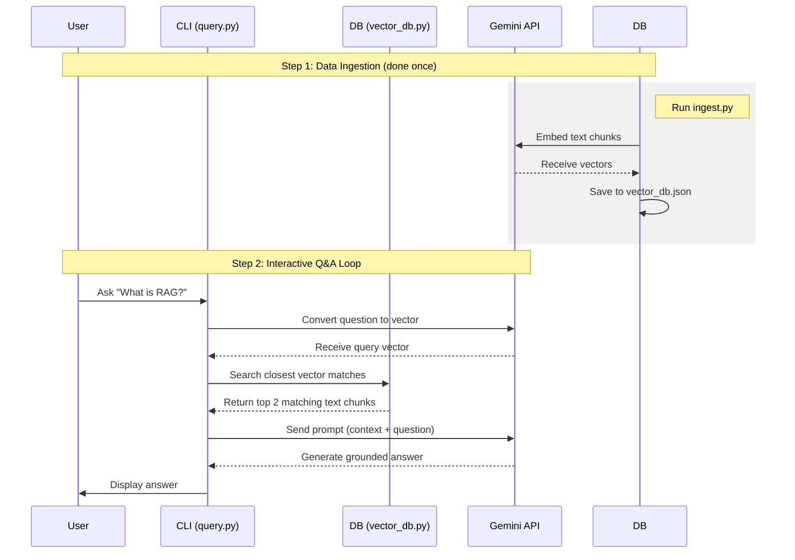

# How the Code Works: Step-by-Step

This guide walks through how the Python files interact to power your RAG application.

---

## 📂 Code Workflow Map

---

## 🗂️ Script Descriptions

### 1. `vector_db.py` (The Database Manager)
This file handles the storage.
*   **`class SimpleVectorDB`**: Holds database records in memory.
*   **`self.load()` / `self.save()`**: Reads from and writes to the local [`vector_db.json`](../vector_db.json) file.
*   **`self.cosine_similarity(v1, v2)`**: Takes two lists of numbers, multiplies matching indexes together, and calculates the angle. This tells us how similar the two vectors are.
*   **`self.query()`**: Loops through all items in the database, runs cosine similarity on each, sorts them, and returns the best matches.

---

### 2. `ingest.py` (The Document Processor)
This script loads and processes documents to populate your database.
*   **`extract_text_from_file(file_path)`**: Reads `.txt` files directly. For `.pdf` files, it uses the `pypdf` library to loop through pages and extract raw text.
*   **`chunk_text(text)`**: Splits the extracted text into chunks.
*   **`embed_text(chunk)`**: Calls `genai.embed_content()` using the model `models/gemini-embedding-001` to fetch the 768-number vector for that chunk.
*   **`db.add()`**: Calls our custom database script to save the text chunk, the vector list, and the document name.

---

### 3. `query.py` (The Q&A CLI Interface)
This script runs the interactive loop in your terminal.
*   **Checks database**: Verifies that [`vector_db.json`](../vector_db.json) is loaded.
*   **`embed_query(question)`**: Converts your typed question into a vector using the same embedding model.
*   **`db.query()`**: Fetches the top 2 matching text chunks from the database. It prints out the exact similarity score so you can inspect how well they matched!
*   **Generates response**: Feeds the matching context chunks, the user's question, and a strict prompt instructing Gemini to **only** use the provided context to answer the question.
